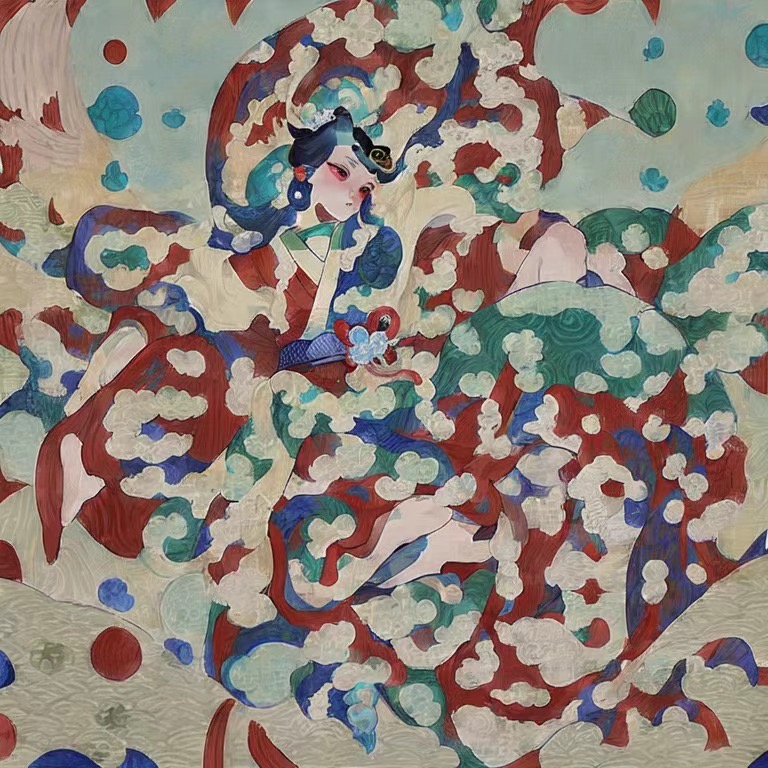
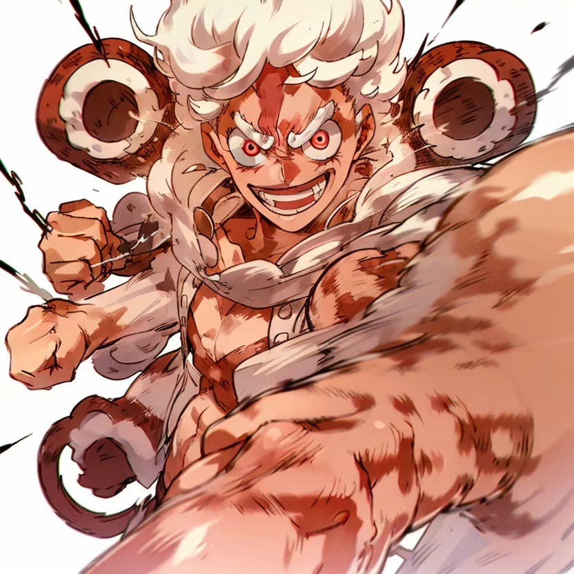
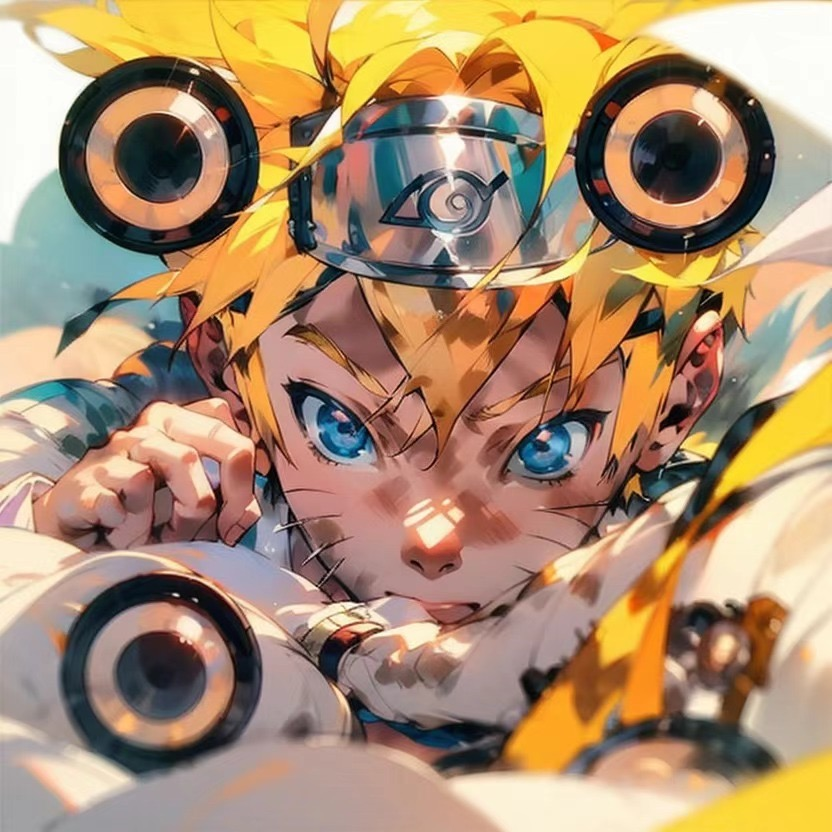
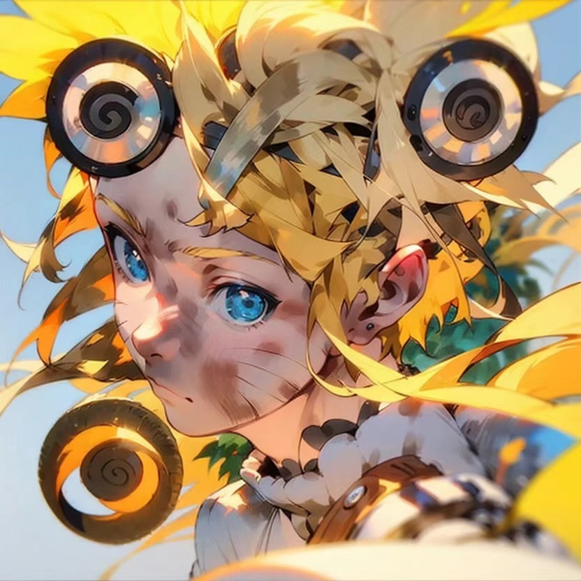
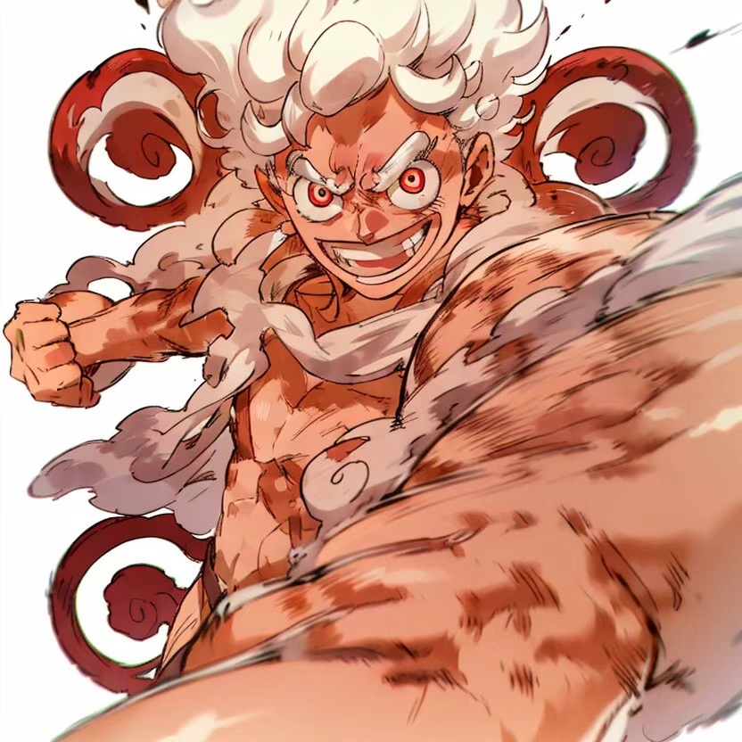

# Stable Diffusion Personal Artwork

This repository showcases a collection of personal artworks created using Stable Diffusion.
## Table of Contents

- [🎨 Styled QR Codes](#-styled-qr-codes)
- [🖌️ WLOP Style Transformation](#-wlop-style-transformation)
- [🖼️ Stable Diffusion Artwork](#-stable-diffusion-artwork)
- [🌟 Others](#-others)

## 🎨 Styled QR Codes

This section presents QR codes that have been artistically styled using Stable Diffusion, blending functionality with aesthetic appeal.

  
  

  
  

## 🖌️ WLOP Style Transformation

This section features artworks transformed into the WLOP style using Stable Diffusion, capturing the unique aesthetic of WLOP's artistry.

  

## 🖼️ Stable Diffusion Artwork

This section showcases various artworks generated with Stable Diffusion, demonstrating its versatility in creating diverse visual pieces.

  
  

## 🌟 Others

This section includes additional creative pieces produced using Stable Diffusion, highlighting various styles and experiments.

  
  
  

